# 联系方式

- 手机：15900836787
- Email：xupengfei2010@gmail.com
- QQ：497801468
- 微信号：libra-xupf
- 个人网站：<http://www.philxu.cn>

# 个人信息

 - 许鹏飞/男/1989 
 - 本科/浙江大学计算机系数字媒体技术 
 - 研究生/浙江大学计算机系计算机应用技术 
 - 工作年限：5年

# 技能清单
- 3D 开发：WebGL/Threejs/GLSL
- Web开发：Nodejs/PHP/Javascript/HTML/CSS
- 前端框架：Vue/AngularJS/Ionic
- 前端工具：Webpack/Gulp/Grunt/SaSS
- 数据库相关：MySQL/PostgreSQL
- 移动端：Android/iOS
- 版本管理、文档和自动化部署工具：Svn/Git
- 云和开放平台：微信开放平台/淘宝开放平台

# 工作经历

## 上海笔尔工业设计有限公司 （ 2015年4月 ~ 至今 ）

### 线下店铺对戒交互定制触摸屏
#### 项目概述
利用threejs构建在触摸屏上使用的对戒DIY工具，用户可对截面、尺寸、宽度、材质、工艺、镶嵌、镭射等多个方面进行定制，程序根据定制参数实时反馈定制的3D效果，并提供实时语音采集解析、指纹采集等多种定制方式。
#### 技术实现
- 触摸大屏展示，适用于触摸操作的交互设计，利用 vue 框架搭建
- 实时建模，对用户操作（切换截面，调整戒指尺寸，戒指宽度）实时反馈
- 利用 glsl 自定义 shader 表现多种材质、工艺
- 利用 glsl 自定义 shader 实时展现声波分色戒指效果
- 利用 nurbs 在戒指表面进行镶嵌排钻，并可对钻大小、类型、波幅等进行调节
- 利用 canvas 生成材质贴图，利用 bumpmap 渲染镭射效果
  - 实时采集指纹
  - 实时采集用户录音，生成录音文件，解析声音波形
  - 嵌入地图，拖动获取坐标
  - 输入文字，选择字体
  - 基于 canvas 的签名板
#### 责任描述
交互设计、独立完成所有功能开发，其中利用 glsl 自定义 shader 表现多种材质、工艺、实时展现声波分色戒指效果，和利用 canvas 生成bumpmap 表现镭射效果等功能，极大的提高用户定制的体验。
#### 项目效果

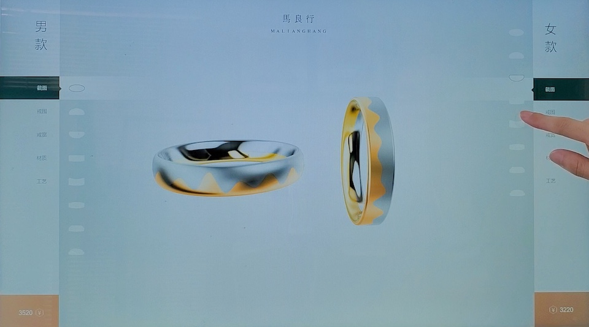
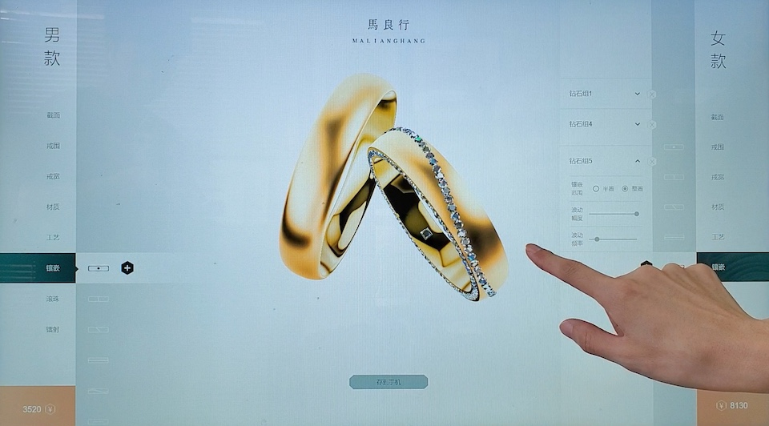
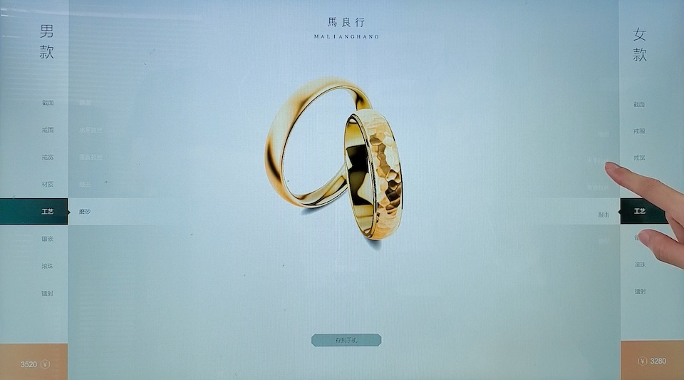
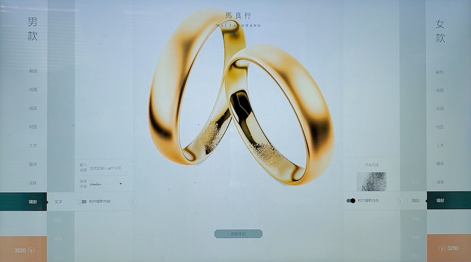

<http://www.philxu.cn/projects/2019/06/26/big-screen/>

### 在线 CAD 建模渲染及导出系统
#### 项目概述
利用threejs构建在触摸屏上使用的DIY定制工具，用户可对定制内容、材质、工艺等多个方面进行定制，程序根据定制参数实时反馈定制的3D效果，支持语音、文字、画板等多种交互模式，并利用 nodejs 搭建 headless 服务还原定制内容，导出 stl 文件，直接可进行 3D 打印。
#### 技术实现
- 适用于触摸操作的交互设计，利用 vue 框架搭建
- 实时建模，对用户操作实时反馈，渲染多种材质效果
- 多种交互定制方式，根据定制内容实时建模
  - 语音输入，解析音频，canvas 绘制波形图
  - 文字输入，选择字体
  - 滑块调节参数
  - 自由画板
  - 地图拖动获取坐标
- 利用 nodejs 模拟除渲染外的 webgl 运行环境，根据用户定制还原3D模型
  - 导出 stl 进行生产
  - 测量 stl 体积

#### 责任描述
交互设计、独立完成所有功能开发，实现用户自主定制下单到工厂生成发货的直连，并以此为技术核心公司获得浦东信息化委员会90万元资助。
#### 项目效果
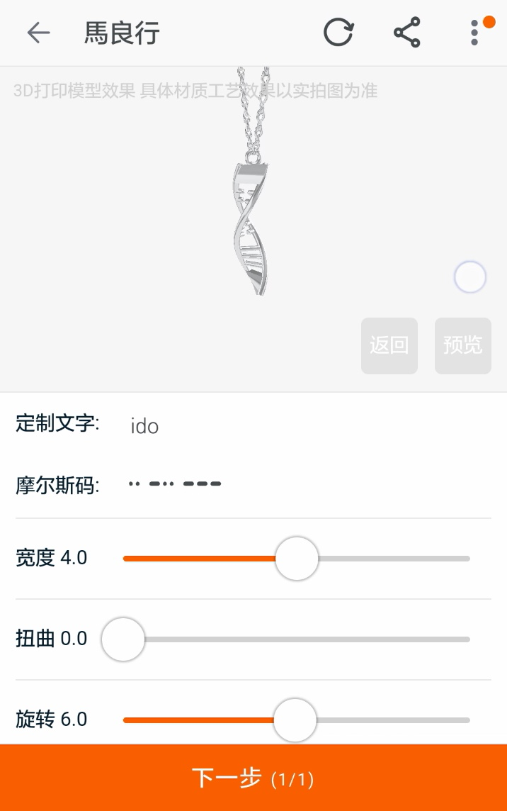
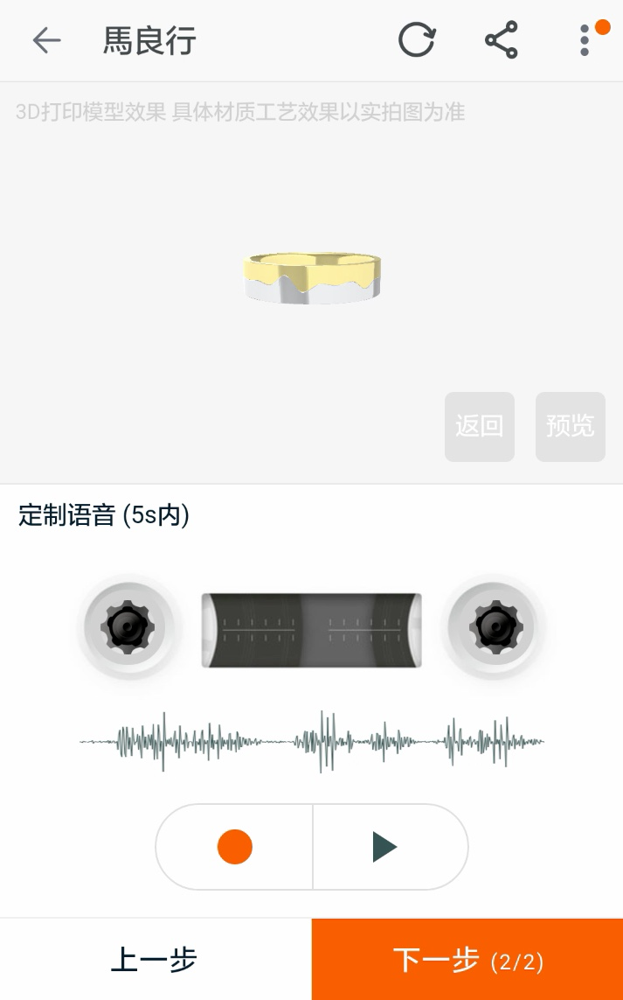
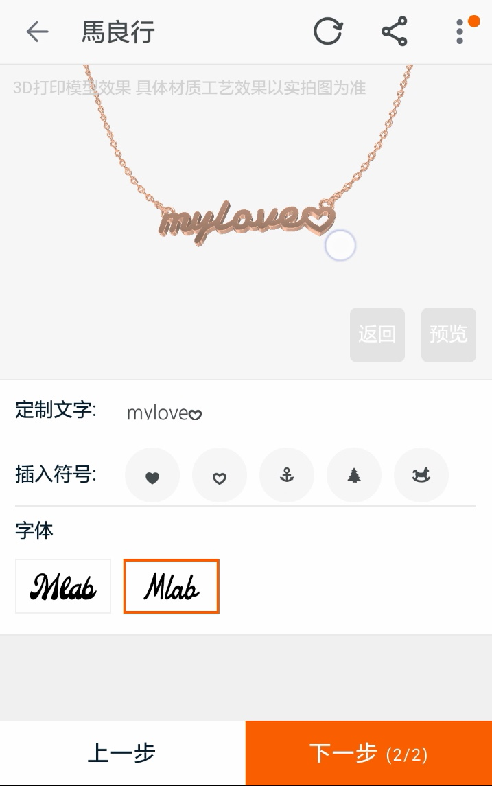

<http://www.philxu.cn/projects/2017/12/31/cad/>

### 馬良行订单管理系统
#### 项目概述
接收汇总官网、京东、淘宝、天猫定制订单，跟踪、改变每笔订单状态，获取订单信息，查看订单 3D 模型，对订单进行修改、加急、报错等操作，导出订单报表等功能
#### 技术实现
- 利用 vue 创建前端页面，app 式体验
- 整合淘宝开放平台 top 接口，京东开放平台 jos 接口
- 数据库采用 orm 方式的 sequelize，mysql作为底层数据库
- jwt 方式注册登录，单点、超时验证
- 快捷筛选与检索
- 订单报表导出为 excel 格式
- 查看订单定制 3D 效果
- 掌握超时订单
#### 责任描述
业务梳理、交互设计、独立完成所有前后端功能开发，项目上线后，极大提高了定制效率，加速对问题订单、超时订单的跟踪处理，降低出错率。
#### 项目效果
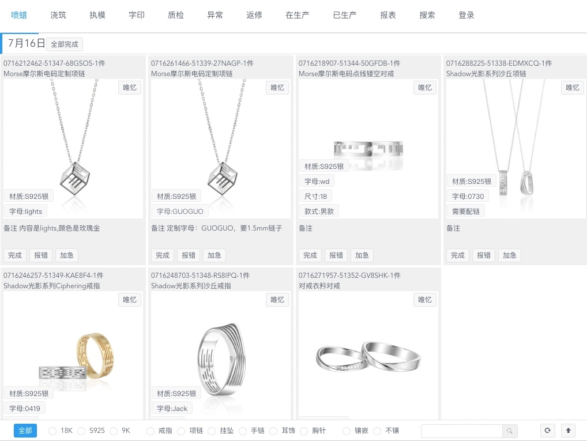
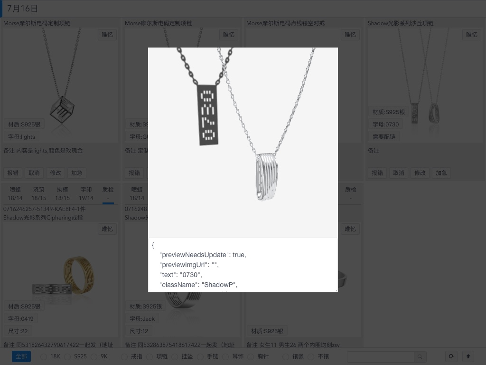

<http://www.philxu.cn/projects/2018/06/06/factory/>

### 天猫在线定制页发布系统

#### 项目概述
天猫在线定制入口提供了商家自定义页面的功能，项目利用 vue 组件化的能力抽象出首饰定制过程中的常用组件，后台发布系统使运维人员有很高的自由度，通过拖拽，修改参数等方式搭建定制产品需要的定制页面，
#### 技术实现
- vue 框架搭建，组件化，并提供丰富定制组件
- 后台采用 nodejs，数据库使用阿里云 RDS mysql 数据库服务
- 拖拽方式直观交互
- 自定义参数丰富，打造多样的定制面板
- 实时预览页面效果及交互效果
- 附带 3D 预览功能
#### 责任描述
项目中独立负责全部交互设计，天猫接口的对接，搭建拖拽式、组件化的编辑发布系统，并使首屏渲染时间符合天猫要求。
#### 项目效果
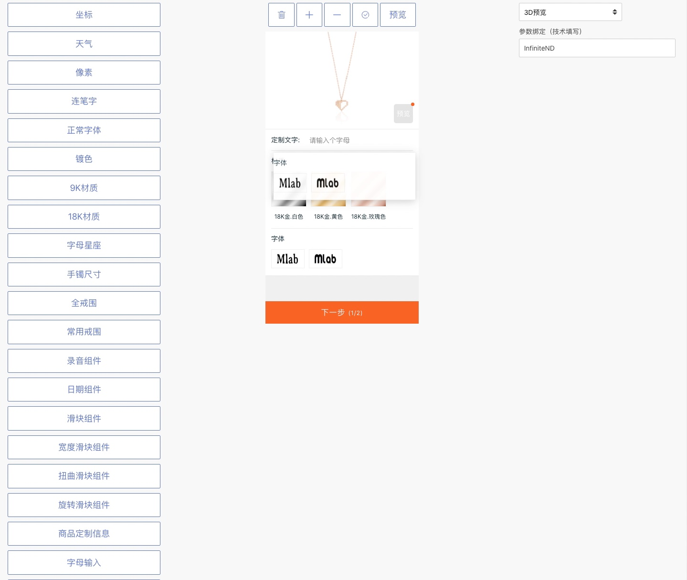
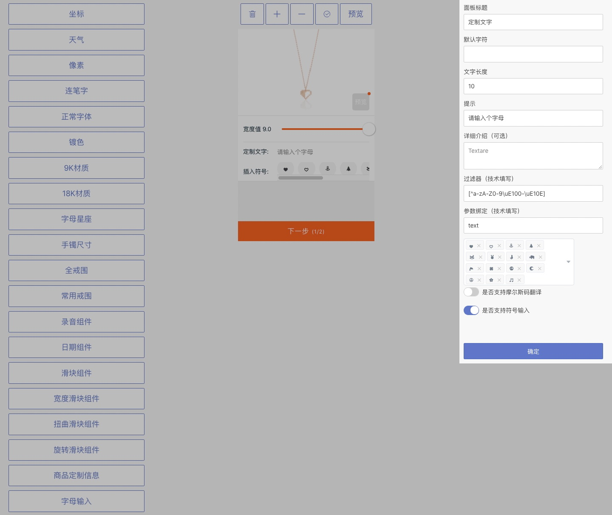

<http://www.philxu.cn/projects/2017/12/31/tmall/>

### 馬良行官网及后台
#### 项目概述
馬良行在线商城，包含常规电商浏览购物功能，创新的3D在线定制模块，网站采用 spa 方式构建，app 式体验
#### 技术实现
- 前端 angularjs 框架搭建，组件化
- 后台采用 nodejs，数据采用 Leancloud 云服务
- 微信登录鉴权、录音等微服务，利用docker 快速开发部署
- 附带 3D 预览功能
#### 责任描述
前期独立负责公司官网html + php前后端，后期配合前端同事采用angularjs完成在线定制模块，配合后端同事采用 nodejs完成下单、订单处理、成本核算等功能及日常维护，并利用 docker 快速开发部署的特点，进行微信开发者模式后台、微信 JSSDK 鉴权录音等微服务的开发，接触了一家独立电商的前后端所有常规业务开发，整个过程不只是技术上的进步，也加深了技术服务于业务，技术选型要结合业务与实际情况的理解。
#### 项目效果
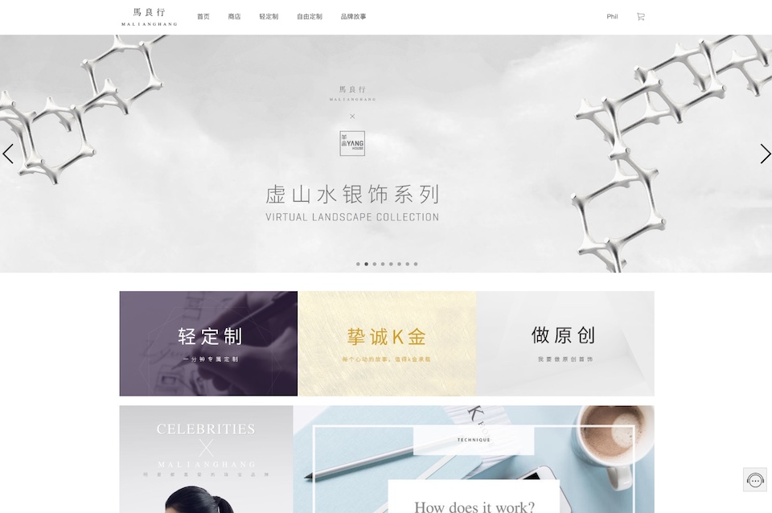
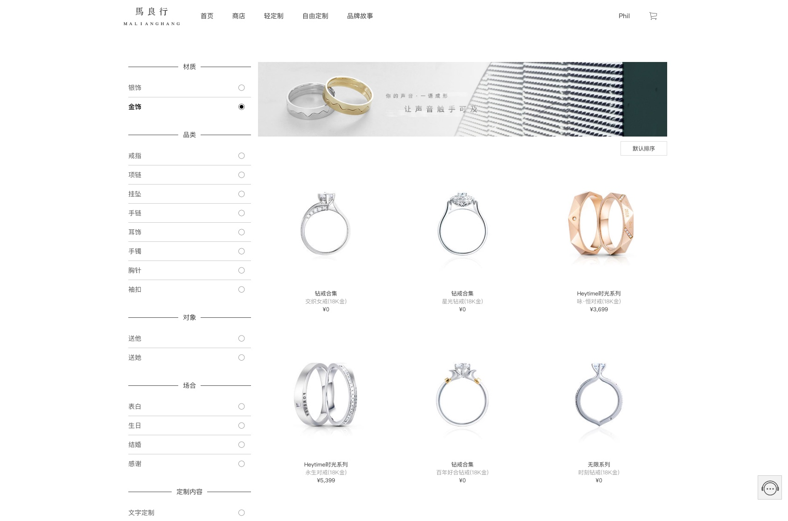
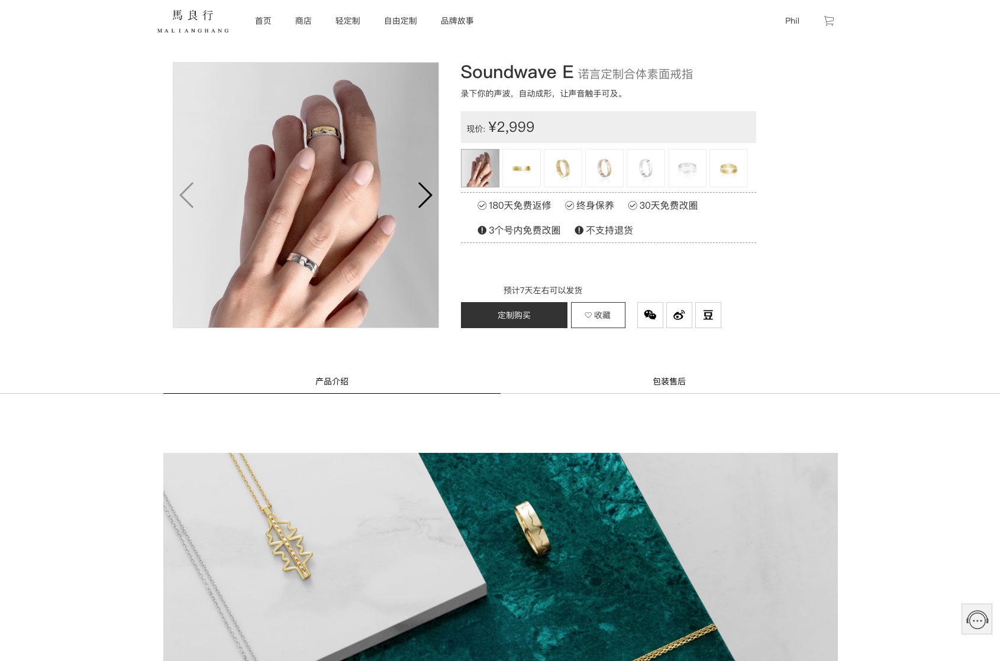
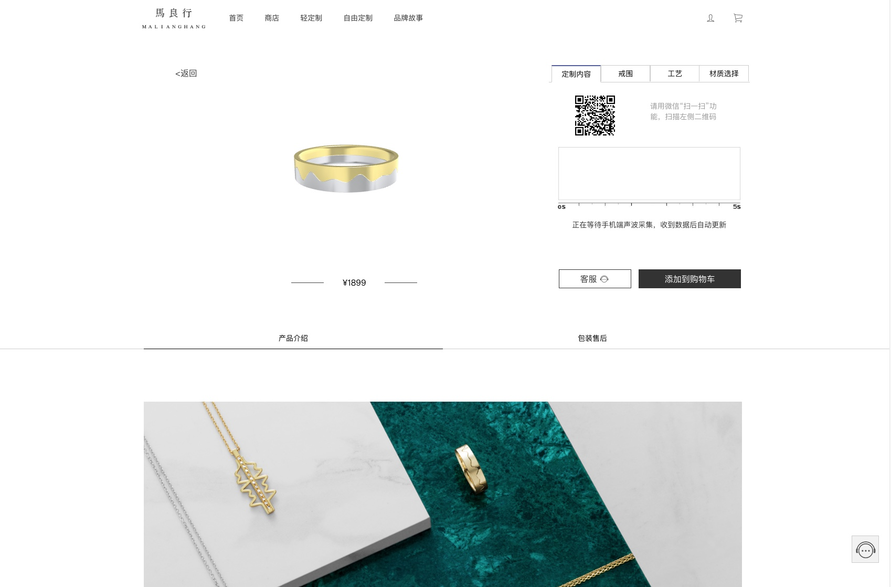

<http://www.malianghang.com>

### 声波明信片交互装置
#### 项目概述
线下互动体验装置，用户通过在 ipad 上录音，实时解析用户声波，识别说的文字，发送弹幕，弹幕从一块屏幕穿越到另一块屏幕变成对应的声音波形图，并可以直接打印声波明信片，用户扫码可重听语音
#### 技术实现
- 利用微信 JSSDK 在线录音、语音识别
- 后台服务解析声音波形
- canvas 绘制波形图
- 利用 socket.io 完成弹幕穿越功能
- 利用树莓派配置 cups 打印驱动，取代 pc，减少装置成本，直接打印声波明信片
- 声波明信片有对应波纹，二维码可重听祝福语音
#### 责任描述
独立完成交互体验设计、前端交互页面、后台解析与弹幕功能、树莓派+打印机联动等相关功能。

#### 项目效果
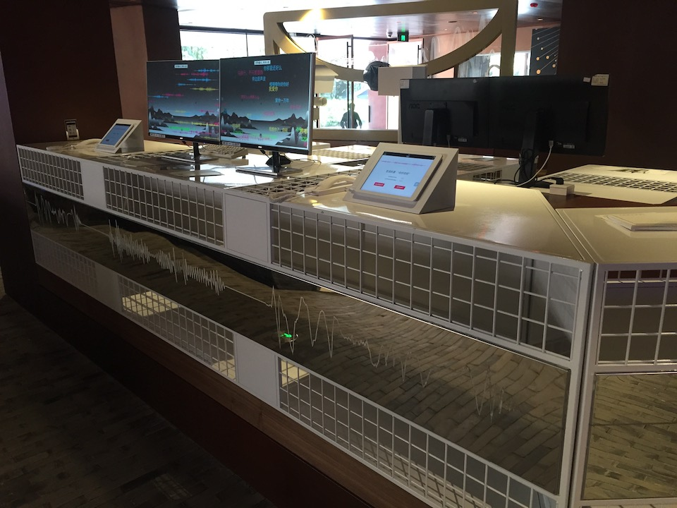
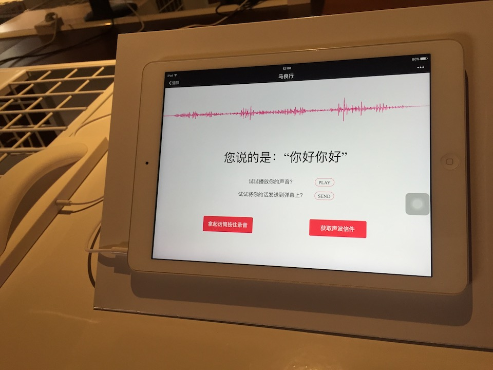
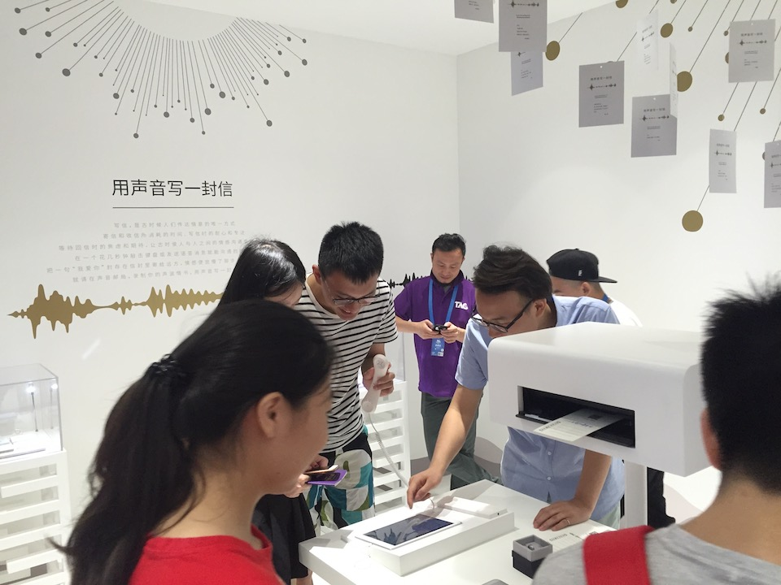
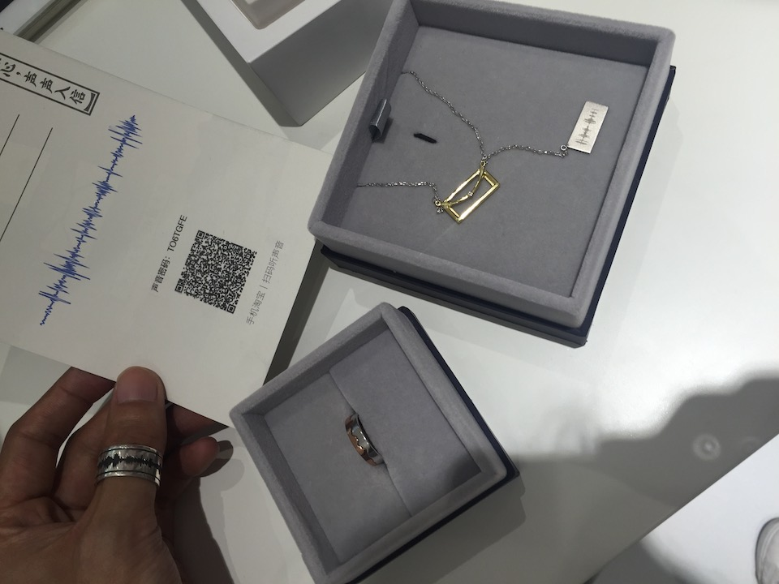

## 阿里云 （ 2012年11月 ~ 2014年12月 ）
### 帝喾云渲染
#### 项目概述
渲染项目主要针对电影动漫产业中的渲染部分，利用阿里云的服务器集群完成每帧渲染
#### 技术实现
- 基于阿里云飞天调度系统
- 采用 c++ 完成调度任务
- 采用 python 完成调用渲染服务脚本

#### 责任描述
主要负责接到调度任务后的渲染部分，还有运维工具搭建，在没有工作经验的情况下迅速掌握 python 完成渲染模块，在完成本职工作基础上，参与到用 c++ 开发的调度任务当中。工作期间完成对《昆塔之盒子总动员》动画电影渲染的支持。

## 其他项目
### Rightmap 3D 地图 SDK
独立完成利用threejs构建在web端使用的3D地图SDK，项目利用 svg 生成3D模型，展示室内地图，利用 canvas 生成材质贴图进行文字图标标注，提供多种相机操作的接口以及自由的事件处理接口等自定义地图需要的功能。项目应用在消防演习等领域。在不断实际应用中也在不断完善，特别是在加载性能方面获得的很大提升，同时能够迅速添加客户需求的新功能。
#### 项目概述
利用threejs构建在web端使用的3D地图SDK，项目利用 svg 生成3D模型，展示室内地图，利用 canvas 生成材质贴图进行文字图标标注，提供多种相机操作的接口以及自由的事件处理接口等自定义地图需要的功能。
#### 技术实现
- 自定义地图数据 json 格式，多配置项
- 房间图元由 svg 定义， 解析 svg 自动生成3D模型，支持如下 svg 标签
  - polyline
  - rect
  - line
  - ellipse
  - circle
  - polygon
  - path
- 利用 canvas 生成材质贴图，进行文字、图标标注
- 自由的事件处理
  - 图元点击响应
  - 缩放事件响应
  - 点击坐标响应
- 支持主题配色、背景色、墙体/实体模式、描边
- 支持墙体、地面贴图
- 利用 vue 构建内部 UI 
- 自定义UVN相机，提供接口以构建自定义 UI
  - 2D/3D 切换
  - 缩放
  - 旋转相机
  - 重置视角
  - 楼层切换
- 导航支持
  - 显示路径
  - 显示当前点及范围
- webpack 打包 umd 形式库文件，可方便嵌入各框架或纯 html
- 支持PC、移动端交互
#### 责任描述
独立完成交互设计、SDK 接口设计，已经相关开发调试工作，项目应用在消防演习等领域。在不断实际应用中也在不断完善，特别是在加载性能方面获得的很大提升，同时能够迅速添加客户需求的新功能。
#### 项目效果
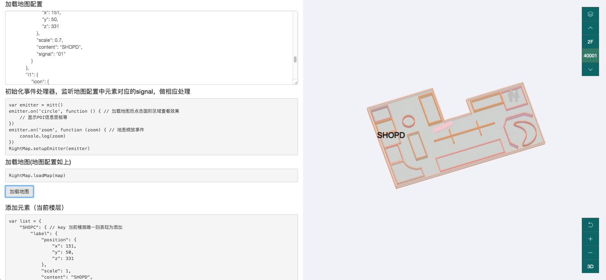
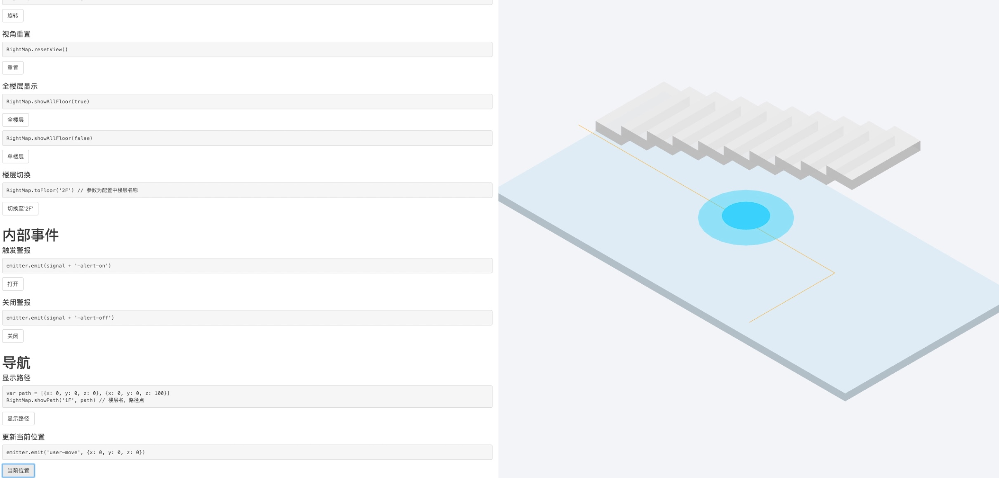 

<http://rightmap.ews.m.jaeapp.com/demo.html>

### 泽尚官网及后台
#### 项目概述
泽尚在线商城，常规电商浏览购物功能
#### 技术实现
- 前端 vue 框架搭建，组件化
- 商城后台采用 php，数据库采用 mysql
- 封装支付宝、微信支付服务，兼容 ping++
- 其他第三方登录、下单、发货等电商功能
#### 责任描述
完成泽尚pc、移动在线商城的vue版本前端搭建，提高了网站整体用户体验，完成 php 后台的重构以及新功能的添加，封装自主的支付服务，无缝移除对 ping++ 收费版的依赖。
#### 项目效果
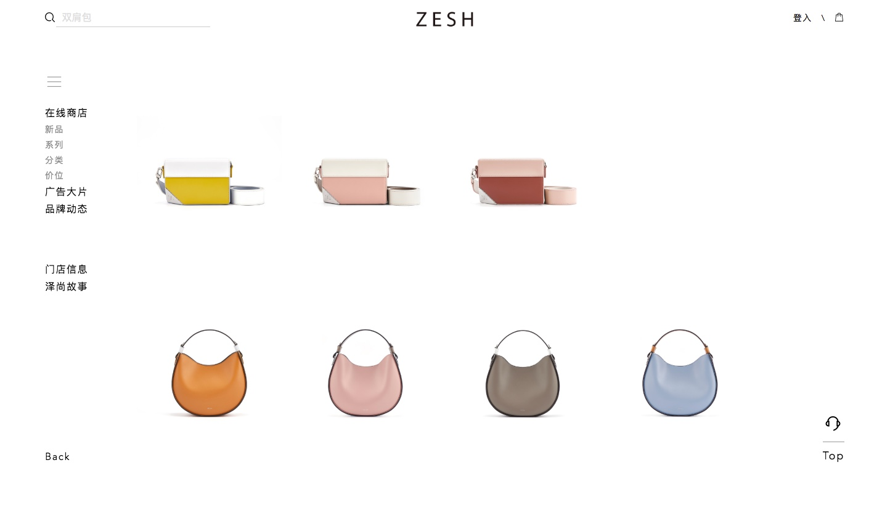
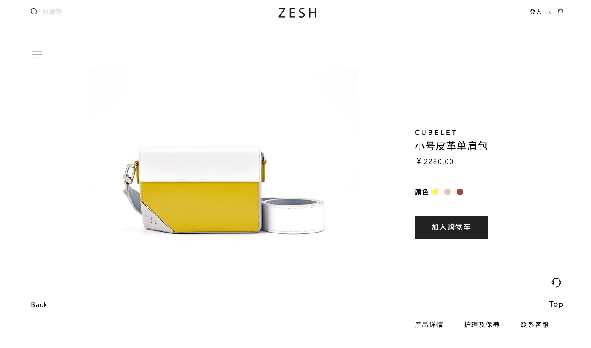
    
<http://www.zeshlife.com>

### 泽尚线下订单处理系统
#### 项目概述
线下订单处理，库存管理，门店管理，报表功能
#### 技术实现
- 前端 vue 框架搭建，组件化
- 后台采用 nodejs
- 数据库采用 orm 方式的 sequelize，mysql作为底层数据库
- 封装 echart vue 组件，提供直观的数据展示形式
#### 责任描述
独立完成 nodejs + mysql + vue 的线下订单处理系统，改变以往 excel 表格的处理方式，为数据提供更直观的展示方式。
#### 项目效果

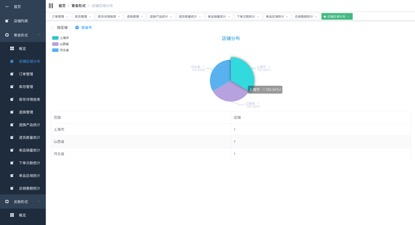
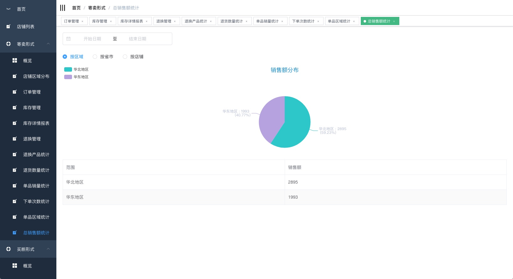
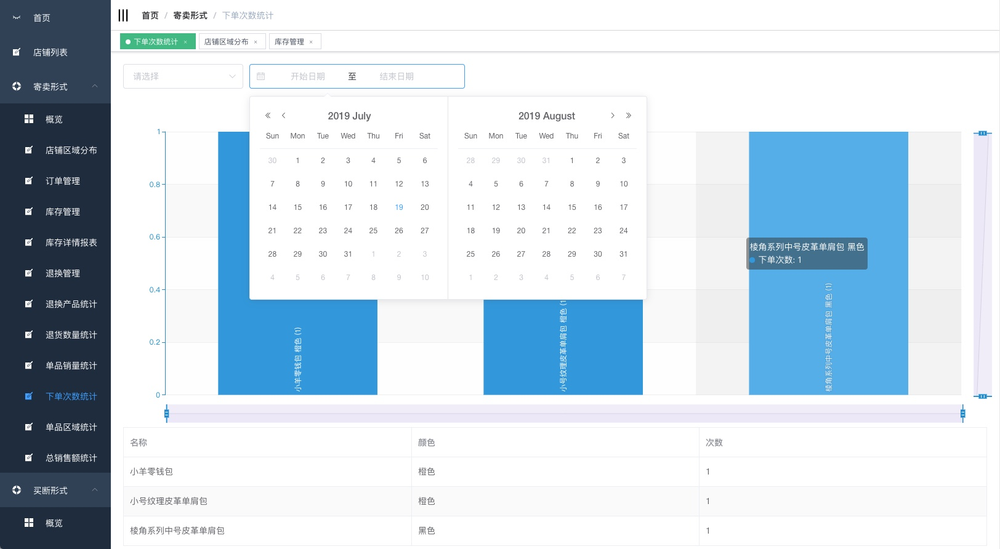
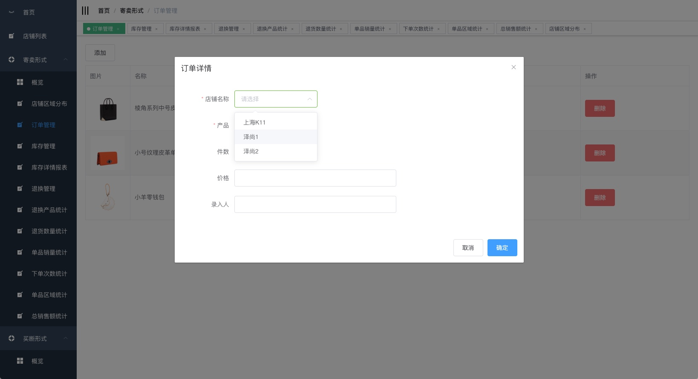

      
