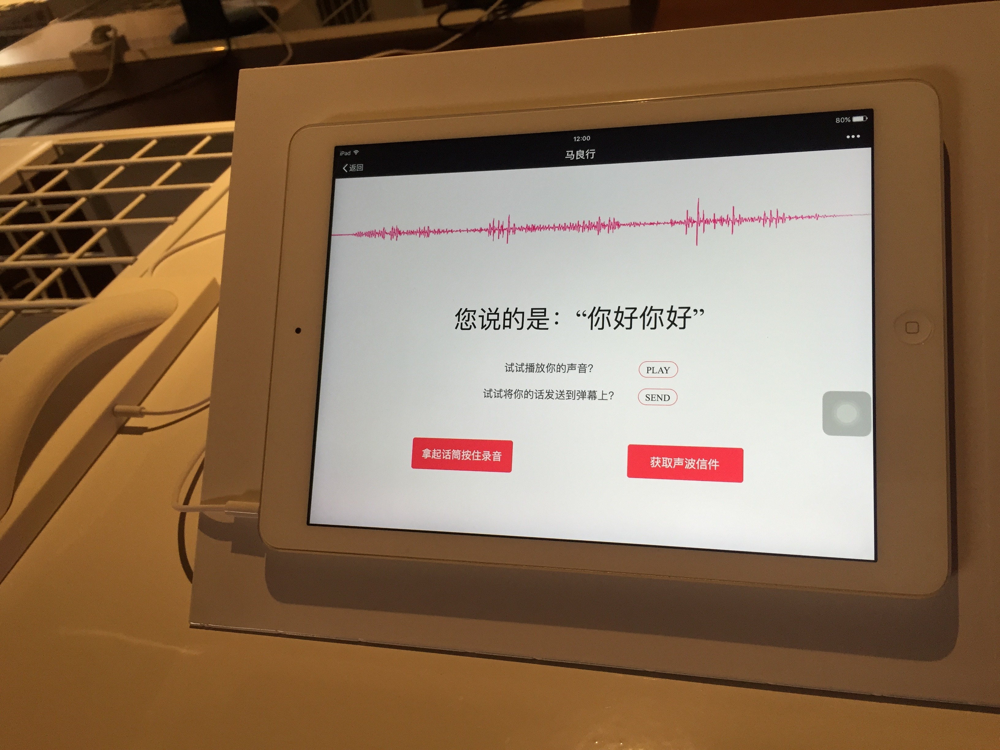

# 利用 socket.io 树莓派 制作现场打印声波明信片装置
## 功能概述
线下互动体验装置，用户通过在 ipad 上录音，实时解析用户声波，识别说的文字，发送弹幕，弹幕从一块屏幕穿越到另一块屏幕变成对应的声音波形图，并可以直接打印声波明信片
## 程序亮点
- 利用微信 JSSDK 在线录音、语音识别
- 后台服务解析声音波形
- 利用 socket.io 完成弹幕穿越功能
- 利用树莓派配置 cups 打印驱动，取代 pc，减少装置成本，直接打印声波明信片
- 声波明信片有对应波纹，二维码可重听祝福语音

::: run {title: '局部配置', 'height': '200px', row: false, reverse: true}
```html
<template>
    <div>通过局部配置实现<b>高度自定义</b>和<b>左右布局</b></div>
</template>
<style>
    b {
        color: #3eaf7c;
    }
</style>
` ` `
:::

## 功能展示
### 互动全景
#### 弹幕从一块屏幕穿越到另一块屏幕变成对应的声音波形图


### 录音界面
#### 实时解析用户声波，识别说的文字


### 直接打印
#### 通过树莓派直接打印

#### 树莓派连接


### 明信片
#### 声波明信片有对应波纹，二维码可重听祝福语音


