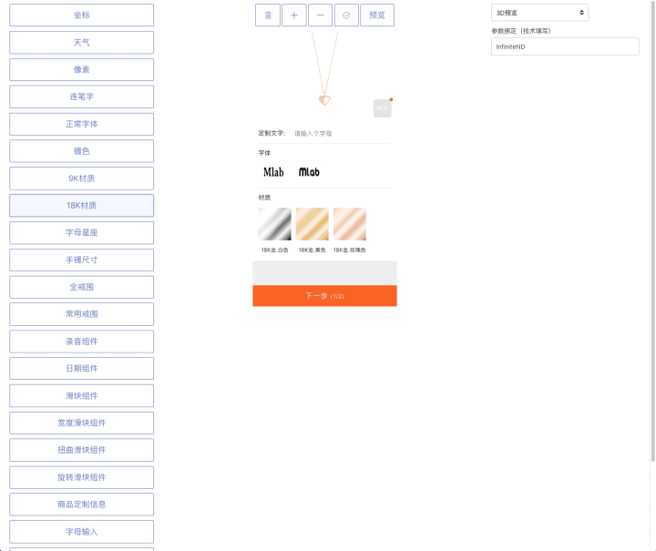
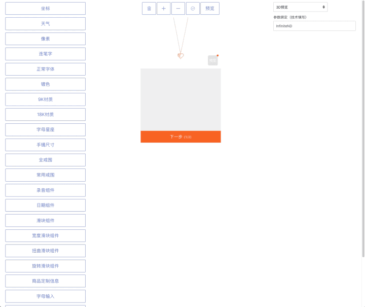
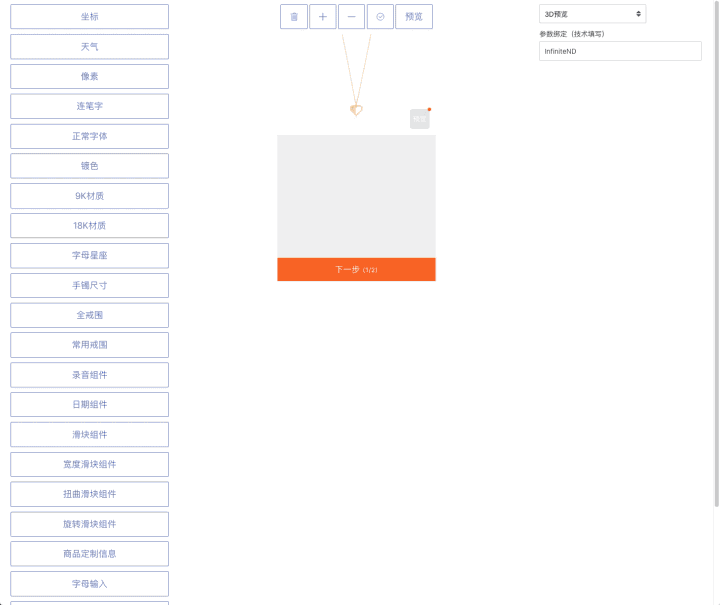
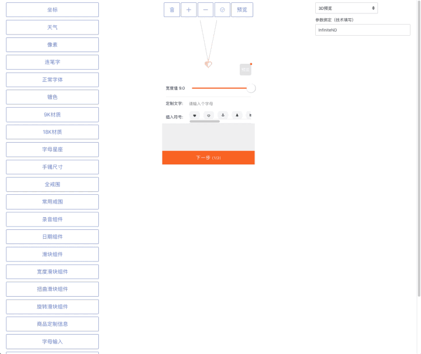
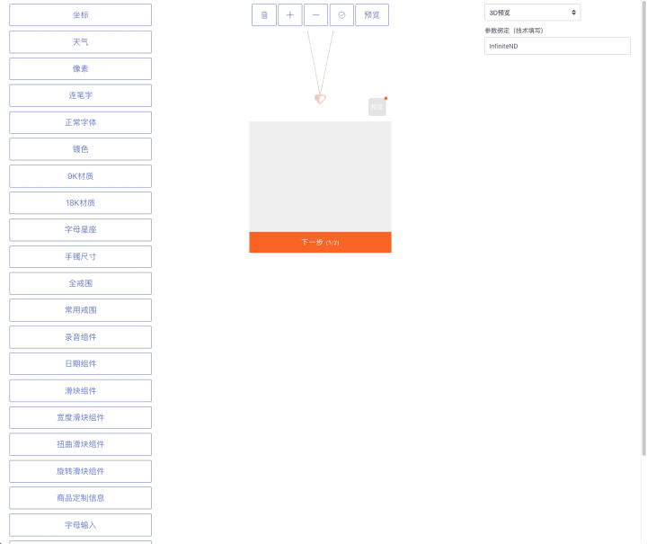
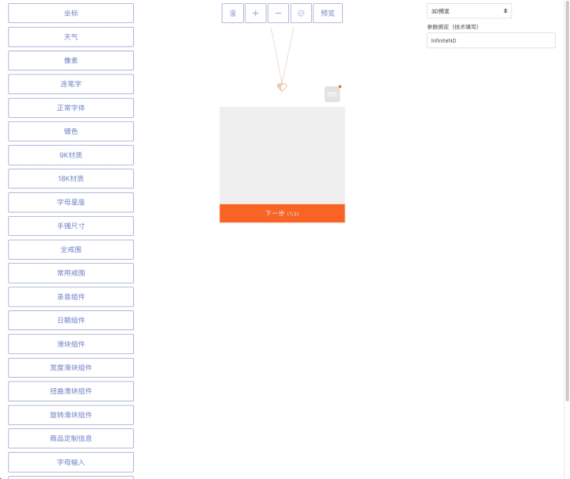
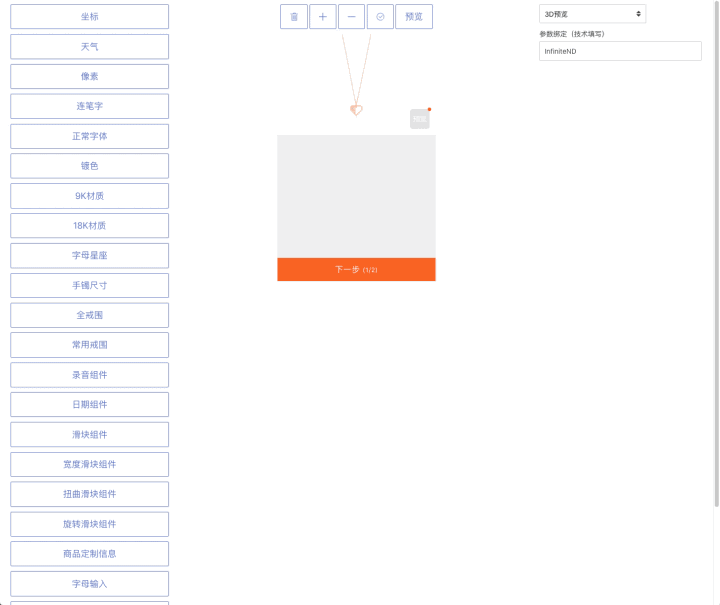
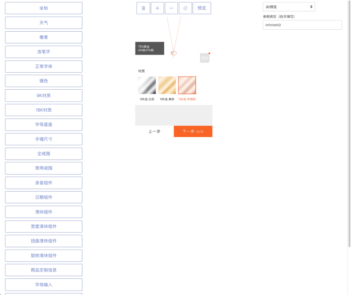

# 利用 vue 构建组件化的定制页面发布系统
## 功能概述
利用 vue 组件化的能力，封装交互组件，采用拖动的方式添加、排列、增加页面，展开详细面板编辑交互逻辑、添加预览、键值等操作，最终发布在手机淘宝中使用的定制信息采集页。
## 程序亮点
- vue 框架搭建，组件化，并提供丰富定制组件
- 拖拽方式直观交互
- 自定义参数丰富，打造多样的定制面板
- 实时预览页面效果及交互效果
- 附带 3D 预览功能

## 功能展示

### 组件布局
- 拖动添加、排序
- 拖动删除
- 增加定制页
- 定制信息汇总页

### 按钮组件
- 自定义添加按钮
- 修改背景图

- 自定义按钮大小
- 添加点击预览图切换响应

### 输入组件
- 自定义输入限制
- 摩尔斯码展示
- 特殊符合输入

### 滑动组件
- 自定义取值范围
- 自定义步长

### 地图组件
- 拖拽获得城市名及坐标值

### 录音组件
- 长按或点击开始录音，松开或再次点击结束录音
- 展示录音波形图
- 历史录音，切换对比

### 预览组件
- 图片切换预览
- 3D 预览

