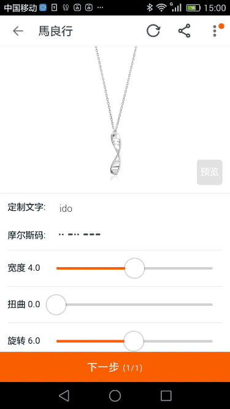
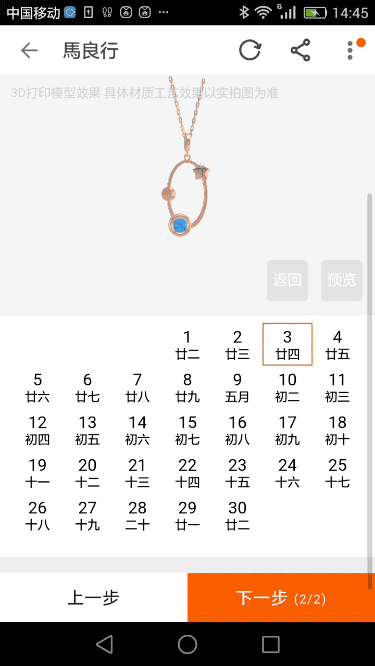
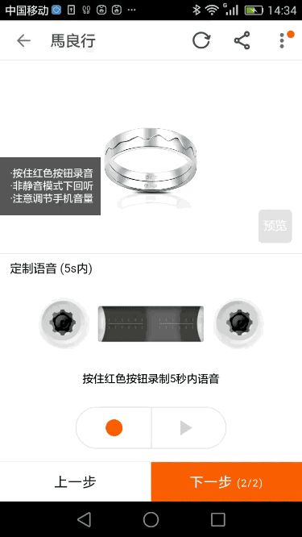
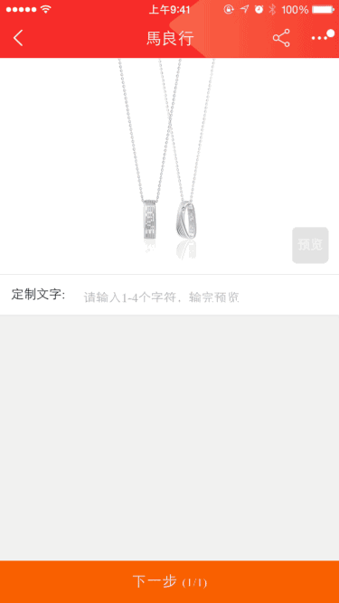
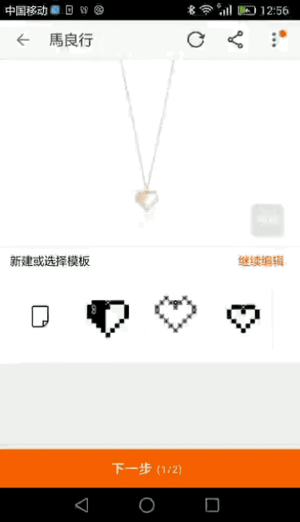

# 利用 threejs canvas vue 打造天猫/官网在线CAD定制模块
## 功能概述
利用threejs构建在触摸屏上使用的DIY定制工具，用户可对定制内容、材质、工艺等多个方面进行定制，程序根据定制参数实时反馈定制的3D效果，支持语音、文字、画板等多种交互模式，并利用 nodejs 搭建 headless 服务还原定制内容，导出 stl 文件，直接可进行 3D 打印。
## 程序亮点
- 适用于触摸操作的交互设计，利用 vue 框架搭建
- 实时建模，对用户操作实时反馈，渲染多种材质效果
- 多种交互定制方式，根据定制内容实时建模
  - 语音输入，解析音频，绘制波形图
  - 文字输入，选择字体
  - 滑块调节参数
  - 自由画板
  - 地图拖动获取坐标
- 利用 nodejs 模拟除渲染外的 webgl 运行环境，根据用户定制还原3D模型，导出 stl 进行生产

## 功能展示
### DNA项链
- 按定制文字生成 morse 码
- 滑块调节参数，对项链进行扭曲，旋转等操作

### 星盘项链
- 根据日期定制
- 利用 tweenjs，在 requestAnimationFrame 中完成定制后的动画效果

### 声波戒指
- 在线录音，解析声波
- 根据波形生成3D 模型
- 分色材质

### 光影项链
- 利用隐藏物体，模拟阴影

### 像素点项链
- 构建画板模块，有两种画笔，橡皮，后退，居中对齐等功能
- 自动计算连通性，对于不可生产的设计予以提示

