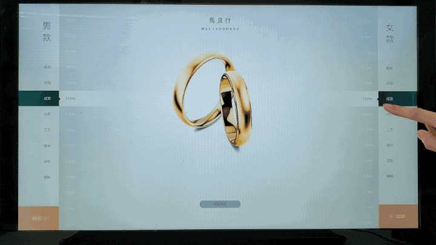
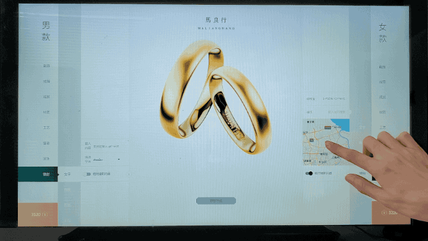
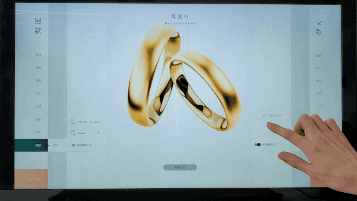

# 利用 threejs canvas 打造DIY对戒定制器
## 功能概述
利用threejs构建在触摸屏上使用的对戒DIY工具，用户可对截面、尺寸、宽度、材质、工艺、镶嵌、镭射等多个方面进行定制，程序根据定制参数实时反馈定制的3D效果  
## 程序亮点
- 触摸大屏展示，适用于触摸操作的交互设计，利用 vue 框架搭建
- 实时建模，对用户操作（切换截面，调整戒指尺寸，戒指宽度）实时反馈
- 利用 glsl 自定义 shader 表现多种材质、工艺
- 利用 glsl 自定义 shader 实时展现声波分色戒指效果
- 利用 nurbs 在戒指表面进行镶嵌排钻，并可对钻大小、类型、波幅等进行调节
- 利用 canvas 生成材质贴图，利用 bumpmap 渲染镭射效果
  - 实时采集指纹
  - 实时采集用户录音，生成录音文件，解析声音波形
  - 嵌入地图，拖动获取坐标
  - 输入文字，选择字体
  - 基于 canvas 的签名板

## 功能展示
### 实时声波

### 触摸操作

### 选择截面

### 选择尺寸

### 选择宽度

### 选择材质

### 选择工艺

### 镶嵌排钻

### 滚珠修饰

### 镭射文字

### 镭射指纹

### 镭射声波

### 镭射坐标

### 镭射签名

## 演示视频
<video src="../_images/big-screen/big-screen.mp4" width="100%" height="auto"
controls="controls"></video>

