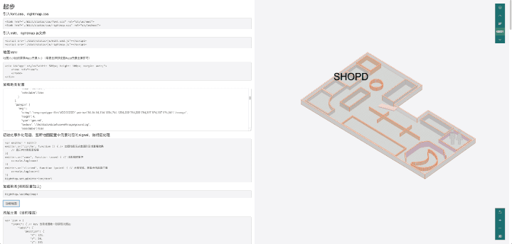
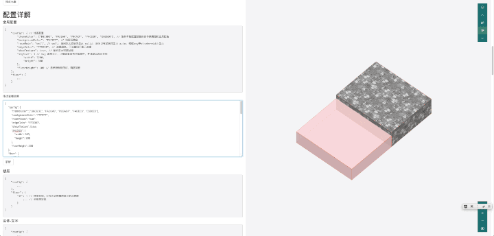
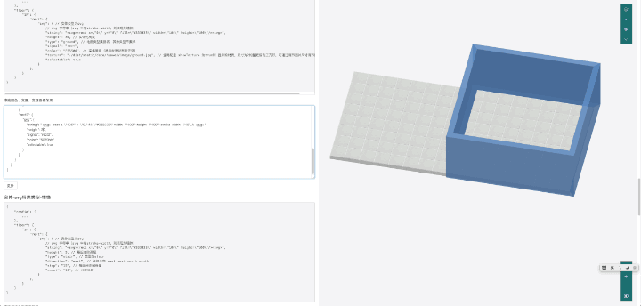
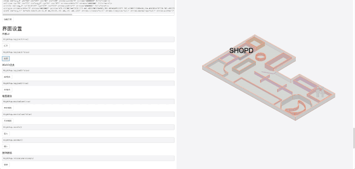
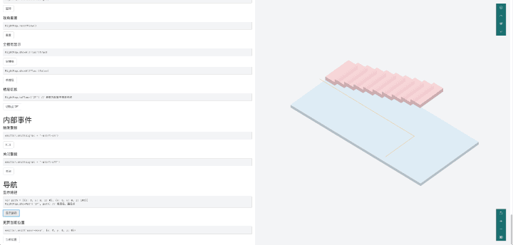

# 利用 threejs svg 打造室内3D地图SDK
## 功能概述
利用threejs构建在web端使用的3D地图SDK
## 程序亮点
- 自定义地图数据 json 格式，多配置项
- 房间图元由 svg 定义， 解析 svg 自动生成3D模型，支持如下 svg 标签
  - polyline
  - rect
  - line
  - ellipse
  - circle
  - polygon
  - path
- 利用 canvas 生成材质贴图，进行文字、图标标注
- 自由的事件处理
  - 图元点击响应
  - 缩放事件响应
  - 点击坐标响应
- 支持主题配色、背景色、墙体/实体模式、描边
- 支持墙体、地面贴图
- 利用 vue 构建内部 UI 
- 自定义UVN相机，提供接口以构建自定义 UI
  - 2D/3D 切换
  - 缩放
  - 旋转相机
  - 重置视角
  - 楼层切换
- 导航支持
  - 显示路径
  - 显示当前点及范围
- webpack 打包 umd 形式库文件，可方便嵌入各框架或纯 html
- 支持PC、移动端交互

## 功能展示
### 加载、旋转平移缩放及点击事件

### 配置贴图、墙体显示方式、描边等

### 图元配置，墙体厚度、高度等

### 内置 UI、自定义 UI 接口

### 定位导航显示

## 更多可配置项
[DEMO](http://rightmap.ews.m.jaeapp.com/demo.html)

